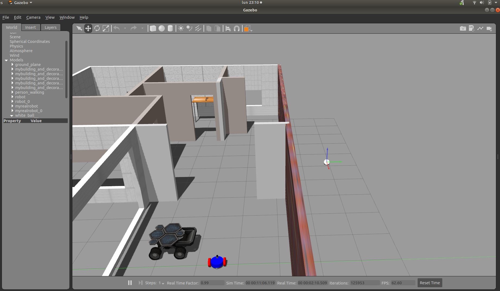
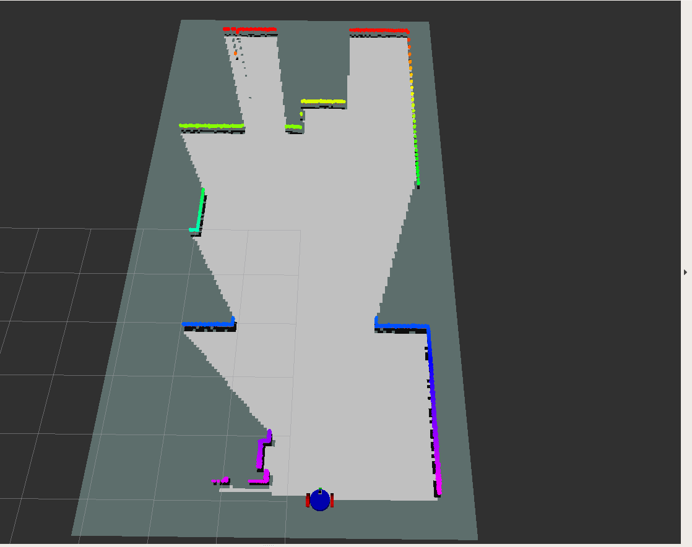
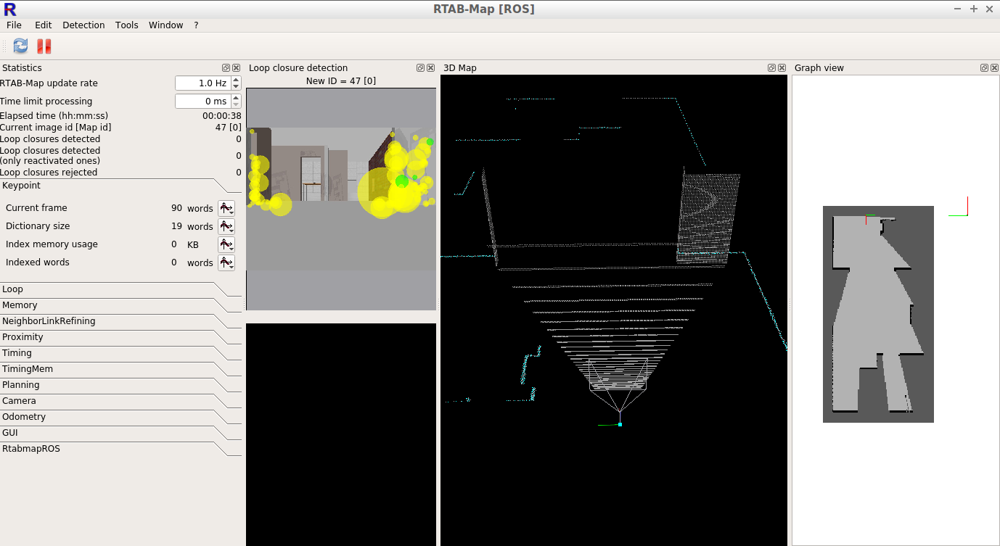
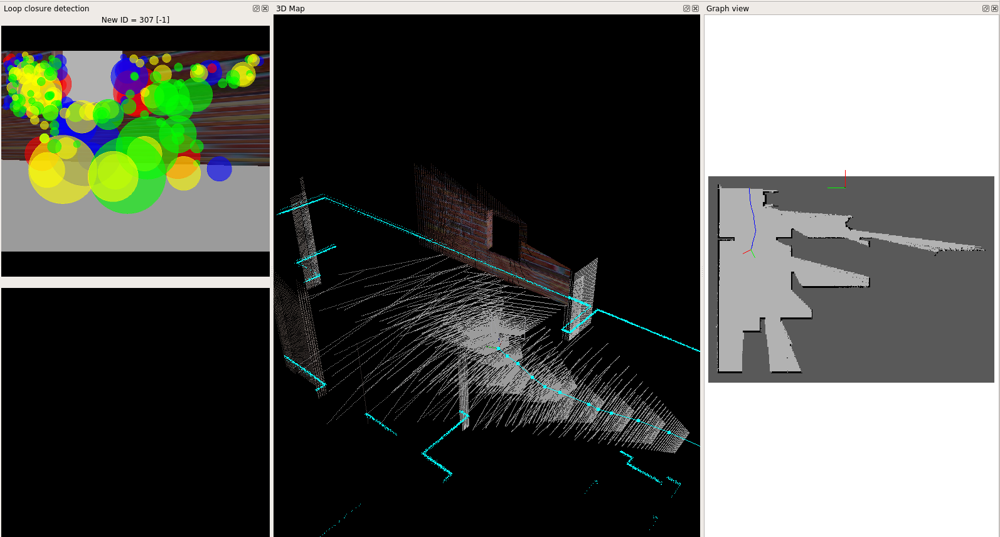
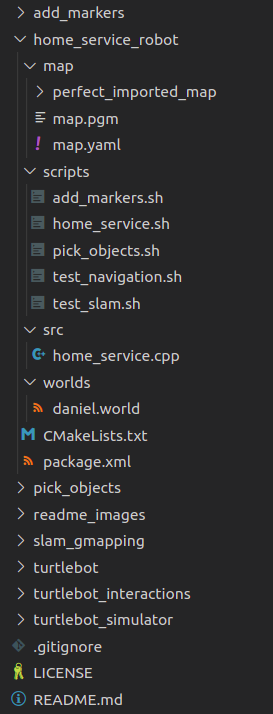

# map_my_world
map_my_world is basic robot simulation focused on 2D & 3D mapping and localization. This project can be used as a base/template project to start your own modified project.

It is basically composed by three different components:
- The simulation of the robot that holds a world and a very simple robot inside.
- Configuration for rtabmap_ros package that enables the robot to get information from RGBD camera and odometry and outputs the 3D map and his localization.

# Installation
This simulation have been created and tested in:
- [Ubuntu 16.04](https://ubuntu.com/download/desktop) (supports Ubuntu 16.04) 
- [ROS Kinetic](http://wiki.ros.org/melodic/Installation/Ubuntu) (supports ROS kinetic, with melodic has some issues)
- [Gazebo 7.0](http://gazebosim.org/tutorials?cat=install&tut=install_ubuntu&ver=7.0) (supports Gazebo 7.0 or superior)

Install key pkgs

```bash
sudo apt update
sudo apt install ros-kinetic-navigation
sudo apt install ros-kinetic-map-server
sudo apt install ros-kinetic-move-base
sudo apt install ros-kinetic-rtabmap-ros
```

### Create a catkin workspace to compile and run the simulation

```bash
mkdir -p catkin_ws/src # create 2 folders
cd catkin_ws/src
catkin_init_workspace # createa CMakeLists.txt
cd catkin_ws # go to main folder
catkin_make # create some automatic folders and files
cd src # go to source folder
git clone https://github.com/daniel-lopez-puig/map_my_world_project.git #clone this repository
mv map_my_world_project/* . && rm -r map_my_world
cd .. # go back to catkin_ws
catkin_make
```

### Run the simulation and ROS packages
#### Terminal 1:
This will open two windows, gazebo and rviz.
```bash
cd catkin_ws
source devel/setup.bash
roslaunch map_my_world world.launch
```

In gazebo you can see all the simulated world with the robot and a building.



On the other hand you will have a rviz window thats shows what the robot sees using the laser (colored dots) and what sees the RGBD camera as point clounds.



#### Terminal 2:
This will start creating a map you can see in rviz. It also open a rtab-map window.
```bash
cd catkin_ws
source devel/setup.bash
roslaunch map_my_world mapping.launch
```


**ATENTION!**:

Maps are created and stored by default in `~/.ros/rtabmap.db`
This means that if you create a map, cancel the mapping.launch and run it again, it will OVERRIDE your previous map. So ensure to backup it befoure creating a new map! 

If you want to use the map I already created, you can download it from [here](https://drive.google.com/file/d/1Etm_bQK0pAuwMigycZqhgMjNYXfCaWAf/view?usp=sharing)


#### Terminal 3:
This will allow you to teleop the robot from cl:
```bash
cd catkin_ws
source devel/setup.bash
roslaunch map_my_world teleop.launch
```
Remember to click on the terminal to focus it and control the robot.

After moving a bit, you will start seeing the created 3Dmap as below:



After mapping your enviorment (ensure at least 3 close loops), cancel terminal 2 and run the localization launch file:

#### Terminal 2 (again):
This will start localizing the robot inside the map you have cerated:
```bash
# CTRL+C to cancel previous mapping.launch
roslaunch map_my_world localization.launch
```

# Structure
This package is mainly composed by two folders, **teleop_twist_keyboard** (responsible to drive the robot manually) and the **map_my_world** that simulates the robot, launch all mapping and localization files proper configured.



# Contribute

This project have been done entirely for me while coursing the  [Roftware Software Engineer nando degree program](https://www.udacity.com/course/robotics-software-engineer--nd209) in Udacity. Please feel free to fork and create your own branch with your personalized projects.

# License

Feel free to use this repository to create your own simulation following the [MIT license attached](LICENSE).

# Contact

Do not hesitate to contact me via mail (daniel.lopez.puig@gmail.com) or by [Linkedin](https://www.linkedin.com/in/daniel-lopez-puig/) to give any suggestion or possible colaboration project realated to robotics.
