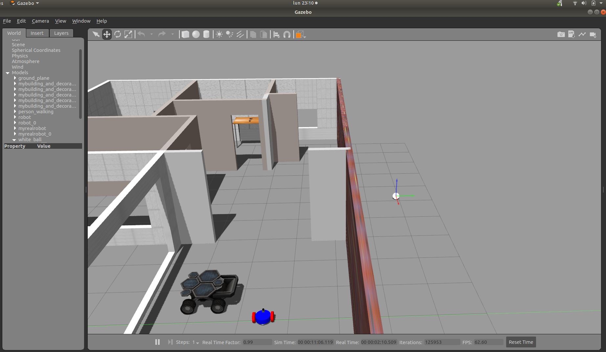
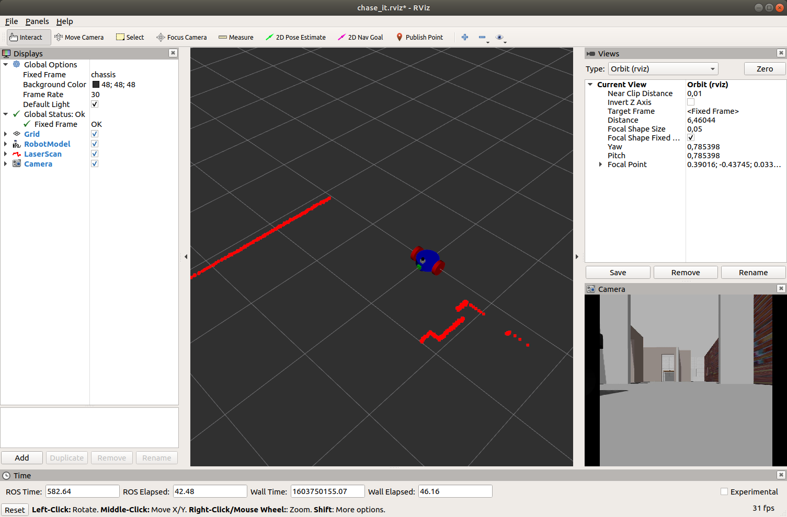

# Chase_it
Chase_it is basic robot simulation that can be used as a base project to start your own modified version.

It is basically composed by two different components:
- The simulation of the robot that holds a world and a very simple robot inside.
- A ROS package that enables the robot to detect and follow a ball in the world.

# Installation
This simulation have been created and tested in:
- [Ubuntu 18.04](https://ubuntu.com/download/desktop) (supports Ubuntu 16.04 or superior) 
- [ROS Melodic](http://wiki.ros.org/melodic/Installation/Ubuntu) (supports ROS kinetic or superior)
- [Gazebo 9.0](http://gazebosim.org/tutorials?cat=install&tut=install_ubuntu&ver=9.0) (supports Gazebo 7.0 or superior)

### Create a catkin workspace to compile and run the simulation

```bash
mkdir -p catkin_ws/src # create 2 folders
cd catkin_ws # go to main folder
catkin_make # create some automatic folders and files
cd src # go to source folder
git clone git@github.com:daniel-lopez-puig/chase_it.git #clone this repository
cd .. # go back to catkin_ws
catkin_make
```

### Run the simulation
This will open two windows, gazebo and rviz.

```bash
cd catkin_ws
source devel/setup.bash
roslaunch my_robot daniel.world
```

In gazebo you can see all the simulated world with the robot, a building and a white ball.


On the other hand you will have a rviz window thats shows what the robot sees using the laser (red lines) and the front camera (bottom right image).


### Run the ROS package
Now to run the ROS package that runs the logic, open a second terminal, and run the following commands

```bash
cd catkin_ws
source devel/setup.bash
roslaunch ball_chaser ball_chaser.launch
```

### Let the robot see the ball
Move the ball in a place that the camera can detect it and see how the robot chase it!


# Structure
This package is mainly composed by two folders, **my_robot** (responsible to simulate a world, the robot and all the physics) and the **ball_chaser** that creates the logic.


# Contribute

This project have been done entirely for me while coursing the  [Roftware Software Engineer nando degree program](https://www.udacity.com/course/robotics-software-engineer--nd209) in Udacity. Please feel free to fork and create your own branch with your personalized projects.

# License

Feel free to use this repository to create your own simulation following the [MIT license attached](LICENSE).

# Contact

Do not hesitate to contact me via mail (daniel.lopez.puig@gmail.com) or by [Linkedin](https://www.linkedin.com/in/daniel-lopez-puig/) to give any suggestion or possible colaboration project realated to robotics.