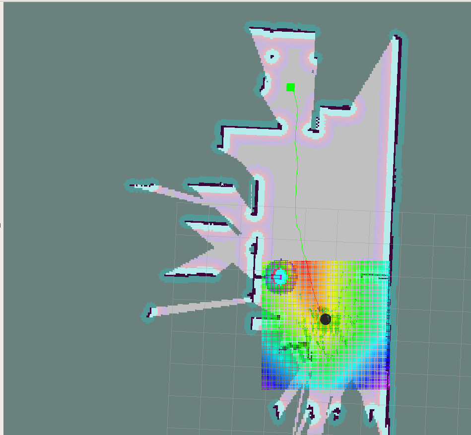
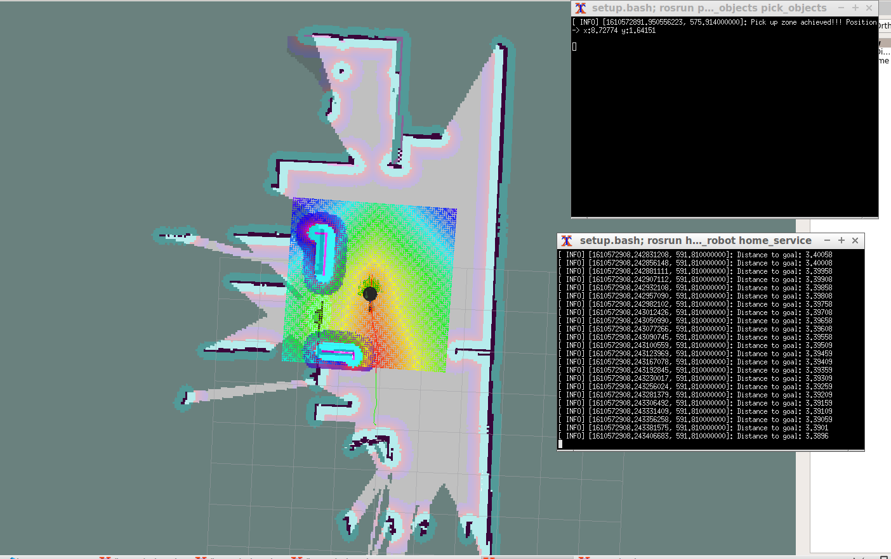
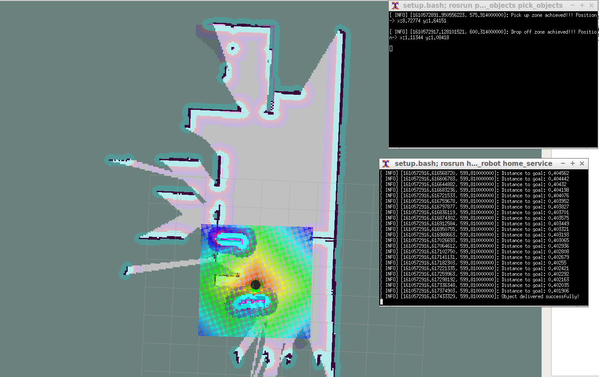

# home_service_robot
home_service_robot is a robot simulation focused on 2D mapping, localization and navigation. This project can be used as a base/template project to start your own modified project.

It is basically composed by the following components:
- The simulation of the robot that holds a world and a very simple robot inside (turtlebot2)
- A SLAM package called [slam_gmapping](http://wiki.ros.org/gmapping) letting us to map, localize and navigate
- Some turtlebot packages helping us to teleop and vizualize our robot and enviorment
- pick_objects and add_markers packages enabling us to automate the simulation of pick and drop objects
- home_service_robot package unifiying all together in different progressive complex scripts
# Installation
This simulation have been created and tested in:
- [Ubuntu 16.04](https://ubuntu.com/download/desktop) (supports Ubuntu 16.04) 
- [ROS Kinetic](http://wiki.ros.org/melodic/Installation/Ubuntu) (supports ROS kinetic, with melodic has some issues)
- [Gazebo 7.0](http://gazebosim.org/tutorials?cat=install&tut=install_ubuntu&ver=7.0) (supports Gazebo 7.0 or superior)

### Create a catkin workspace to compile and run the simulation

```bash
mkdir -p catkin_ws/src # create 2 folders
cd catkin_ws/src
catkin_init_workspace # create CMakeLists.txt
cd catkin_ws # go to main folder
catkin_make # create some automatic folders and files
cd src # go to source folder
git clone https://github.com/daniel-lopez-puig/home_service_robot_project.git #clone this repository
cd .. # go back to catkin_ws
catkin_make
source devel/setup.bash
```

# Structure
This repository has the following structure, where the main and most interesting filers are inside **home_service_robot/scripts** containing the "demos" of this repo.


# Scripts/packages explained
## home_service_robot
Contain the 5 scripts that deomonstarate the power of this repositori, the world and the map:
To run each of them is as simple as do `rosrun home_service_robot <script_name>`.
##### test_slam.sh
Using only build in turtlebot roslaunchs, enables you to start mapping the world using your keyboard.
In order to save it, run the following command:

```bash
rosrun map_server map_saver -f /tmp/my_map
```
Maps are created and stored by default in `~/.ros/map.pgm` and `~/.ros/map.yaml`
This means that if you create a map, cancel the script and do it it again, it will OVERRIDE your previous map. So ensure to backup it befoure creating a new map! 

After saving the map, you can replace files inside `home_service_robot/map/` for these ones to use your own map for the following scripts.

##### test_navigation.sh
Using amcl, your world placed `home_service_robot/worlds` and the map stored inside `home_service_robot/map/` is able to get localized.
Then you can send goals using rviz and it will be able to navigate autonomously until the goals.

##### pick_objects.sh
Adding an extra functionality to the previous demo, 2 goals are automatically placed in the "pick up" and the "drop off" area. `pick_objecs` is the responsible to send the robot to these points.

##### add_markers.sh
Paralel to the previous, `add_markers` package one virtual object based on time to the first goal and later on the "dropp off" area. This is actually an intermediate package that will be copied and modified in `home_service_robot` to create the final and most amazing demo.

##### home_service_robot.sh
Unifying all previous concepts, this script is able to simulate a robot going to a "pick up" zone, pick the object (green cube marker) and drop off in the destination goal sincronising the virtual markers and the position of the robot.
Note how two terminals print the distance to the next goal as well as status goal information.

Start position:


Pick up the object:


Go to "drop off" area:


Success!!!:

# Contribute

This project have been done entirely for me while coursing the  [Roftware Software Engineer nando degree program](https://www.udacity.com/course/robotics-software-engineer--nd209) in Udacity. Please feel free to fork and create your own branch with your personalized projects.

# License

Feel free to use this repository to create your own simulation following the [MIT license attached](LICENSE).

# Contact

Do not hesitate to contact me via mail (daniel.lopez.puig@gmail.com) or by [Linkedin](https://www.linkedin.com/in/daniel-lopez-puig/) to give any suggestion or possible colaboration project realated to robotics.
